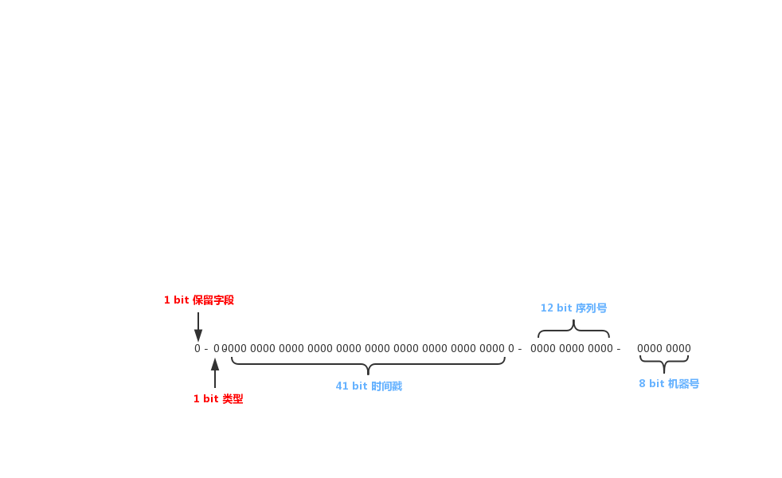
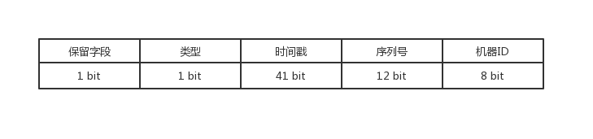
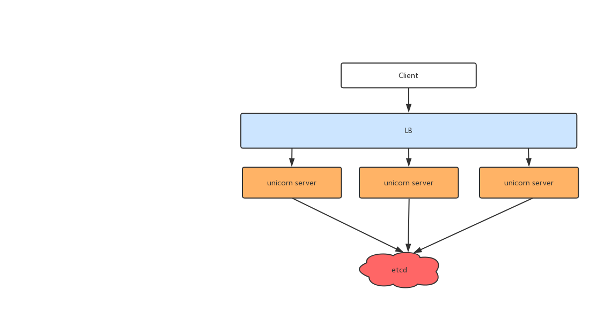

## 一、项目简介

在很多场景，我们都需要对大量的数据和消息进行唯一标识。例如订单，商品等。随着数据的飞速增长，往往会对数据库进行分库分表，分库分表后，需要有一个全局唯一的ID来标识数据，数据库的自增ID显然不能满足需求。

特别的，当多个系统都依赖一个唯一的ID进行标识的时候，有一个全局唯一ID的生成系统是非常有必要的。

## 二、项目需求

在设计**分布式发ID生成系统**时，需要从以下几点考虑

### 1. 全局唯一性

全局唯一是最根本的需求，即系统中的所有ID都是唯一的，可以使用 **分布式锁服务** 或者 **时间序列** 的方式来实现。

### 2. 有序性

没有业务系统希望ID是无序的，因此ID有序是一个非常重要的需求

### 3. 可回溯

可回溯对排查和定位业务系统能够提供帮助，一个生成好的ID本身会携带大量的信息，如果我们的ID可以分解进行回溯，那么可以对业务排查问题提供帮助

### 4. 高吞吐量

对于业务来说，无论是用户下单、用户注册还是新增商品，数据插入对业务来说一定是核心功能，因此如果业务系统依赖`ID生成系统`，那么就需要该系统的**TPS**非常高

### 5. 高可用

业务系统对 `ID生成系统`的可用性要求极高，如果ID生成系统瘫痪，那么用户下单、注册等一系列关键的动作都将无法执行

### 问题

#### 安全问题

如果ID是有序的，恶意用户可能会根据这个规则进行攻击，因此一些系统是需要ID无序的/

但安全性和ID有序性是互斥关系，无法在同一个系统中同时满足，在设计时要做出取舍

#### 时钟回拨问题

如果时钟发生回拨可能会造成ID重复

## 三、系统实现

ID生成算法可以说是整个系统的灵魂，在设计分布式ID生成系统时，ID生成算法参考了 `snowflake` 算法，但在ID的设计上对其做了更改。

### ID设计

ID的bit位参考了 `snowflake`，并在此之上做了变更，如图所示





#### 1. 机器ID

`snowflake` 算法中机器ID为10位，也就是支持 2^10 = 1024 台服务器，但根据实际情况来说，**1024** 台集群的 ID生成系统很少见，因此取舍过后改为 2^8 = 256台服务器，已经能满足大多数公司的业务了

#### 2. 序列号

序列号的多少决定了ID生成的最大吞吐量，`snowflake` 算法中序列号为 10 位，也就是每毫秒最大的吞吐量为 2^10 * 60 

为了提高吞吐量，这里将序列号改为了12位，即在CPU和带宽的允许下，每毫秒的最大吞吐量为 2^12 * 60

#### 3. 时间戳

`snowflake` 算法中的时间戳为41位，计算过后 2^41 / 60 / 60 / 24 /365 ≈ 69.7年，这里我们没有做过多的更改，和雪花算法保持一致

#### 4. 类型

`snowflake` 中是没有类型这个说法的，之所以设计，主要是考虑以下几种情况

- 网络通信可能会带来性能的损耗，本地库的方式嵌入在代码中性能更高
- 分布式ID生成系统挂掉还有本地库做兜底

因此在系统中设计了这个字段，主要支持以下类型

- 00  本地库模式
- 01  API模式
- 02 保留
- 03 保留

#### 5. 保留字段

保留字段默认为 0, 主要为了系统的可扩展性而留的字段

### 系统架构



系统的架构如上图

`unicorn-server` 对外提供服务，且可以无状态部署。

`unicorn-server` 依赖 `etcd` , `etcd` 中主要存储 `unicorn-server`的信息和租约信息。

### 时钟回拨

我们的算法参考了 `snowflake`, 该种算法本质上会依赖时间序列，如果时钟发生了回拨，那么就有可能生成重复的ID，因此需要解决时钟回拨问题。

我们的系统使用租约和心跳来解决时钟回拨问题，具体流程如下

1. 程序启动时通过自身的机器ID获得以往写入的租约信息，其中包含以往的时间，该时间必须大于当前机器时间，如果不大于，则终止启动并告警
2. 如果大于当前机器时间，程序获得所有`unicorn-server`的**临时租约**信息，进行RPC调用，访问所有的机器并计算平均值，如果该值大于阈值则终止启动并告警
3. 如果小于阈值，程序启动成功，之后会周期性的通过心跳消息维持自己的租约

### 服务依赖

可以看到在解决时钟回拨问题，我们实际上是需要依赖 `etcd` 或 `zookeeper` 之类的系统的，当此类系统不可用时，为了维持系统的高可用，我们通常会在本地创建一份信息保存，以便弱化服务依赖，提高服务可用性。

### 模块设计

#### 1. ID模块

id模块是整个系统的核心，id的生成由这部分代码对外提供函数接口

```go
type Generator interface {
	Make() uint64
	UnMake() ExtractData
}
```

`Make` 函数创建一个 id，`UnMake` 分解id得到最初的信息 `ExtractData`, 该结构如下

```go
type ExtractData struct {
	MachineId   int		// 机器ID
	Sequence    uint64 	// 序列号
	Timestamp   uint64 	// 时间戳
	ServiceType int 	// 服务类型
	Reserved    int 	//  保留字段
}
```

在实现`Generator`接口时，采用了 `CAS` ，最大程度提高性能

```go
func (gen *AtomicGenerator) Make() uint64 {
	var sequence, timestamp uint64
	for ; ; {
		oldDataPointer := atomic.LoadPointer(gen.addr)
		oldData := (*data)(oldDataPointer)

		// 旧的sequence
		sequence = oldData.sequence

		// 计算当前的时间戳
		timestamp = genTimestamp(gen.id.cfg.epoch)

		// 如果时间戳相同，去进行sequence的对比
		if timestamp == oldData.lastTimestamp {
			// 计算当前的sequence是否为空，如果为空需要等待下一个时钟
			if sequence = (sequence + 1) & uint64(gen.id.meta.getMaxSequence()); sequence == 0 {
				timestamp = waitNextClock(gen.id.cfg.epoch, oldData.lastTimestamp)
			}

			// 时间戳不同，将sequence置为0
		} else {
			sequence = 0
		}

		// 生成新的数据
		newData := &data{
			sequence:      sequence,
			lastTimestamp: timestamp,
		}

		// CAS设置成功就可以进行新的id计算
		if atomic.CompareAndSwapPointer(gen.addr, oldDataPointer, unsafe.Pointer(newData)) {
			uuid := gen.id.calculate(sequence, timestamp)
			return uuid
		}
	}
}
```

上面代码由个关键的调用，`gen.id.calculate(sequence, timestamp)` ，这行代码会进行 `id` 的计算，计算代码如下

```go
func (id *Id) calculate(sequence, lastTimestamp uint64) uint64 {
	var uuid uint64
	uuid |= uint64(id.cfg.machineId)
	uuid |= uint64(sequence << id.meta.getSeqLeftShift())
	uuid |= uint64(lastTimestamp << id.meta.getTimestampLeftShift())
	uuid |= uint64(id.cfg.serviceType << id.meta.getTypeLeftShift())
	uuid |= uint64(id.cfg.reserved << id.meta.getReservedLeftShift())
	return uuid
}
```


### 高可用

### 容错

### 

## 五、性能测试

